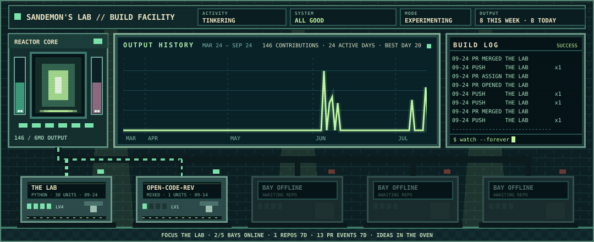

# Kyle Touchet

**AI Native Product Engineer**

 

## Work traces

<!-- harness:start -->

<!-- harness:end -->

## Featured work

**[LadderStar.com](https://ladderstar.com)** is an AI voice coach for real-life practice. Rehearse conversations, presentations, and interviews out loud, get personalized feedback, and try again.

*You need only ask.*

**[sand.gallery](https://sand.gallery)**

